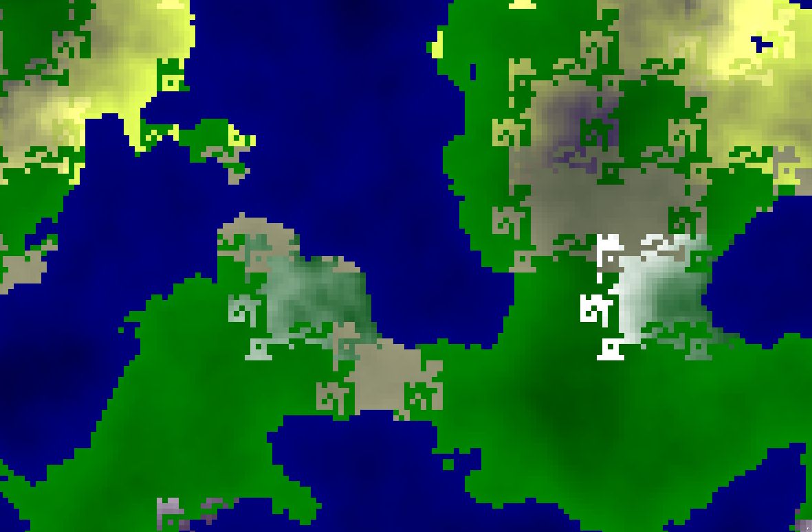

# HEARTLANDS




## Summary

Heartlands is an application with three functionalities:

    - world generation
    - world server
    - UI to view the world

Someday there might be also possibility to interact with the world

## Requirements

Python 3, Node version (?)
more requirements in requirements.txt and package.json

## Running

1. View it [on my website](https://eikrt.com/heartlands)
2. Run it locally


Clone this repository, install requirements in backend with
```pip3 install -r requirements.txt```
and in frontend with
```npm i```

Generate world with 

```python3 creator.py <seed> <width> <height> <chunk size> <sea level>```
where seed can be any integer, width and height something between 0...64, chunk size between 0...64 (suggested) and sea level something between -1 and 1 

```python3 creator.py 100 16 16 16 -0.1```

creates a good example world.

The next step is to start backend. You can do that with
```python3 server.py```
or 
```pm2 server.py```

Time to start frontend. Navigate yourself to frontend directory and 
```npm run start``` if you want to test or develop,
```npm run build```
if you want to deploy.

Docker way of doing things is not currenlty supported, but will be in future.


